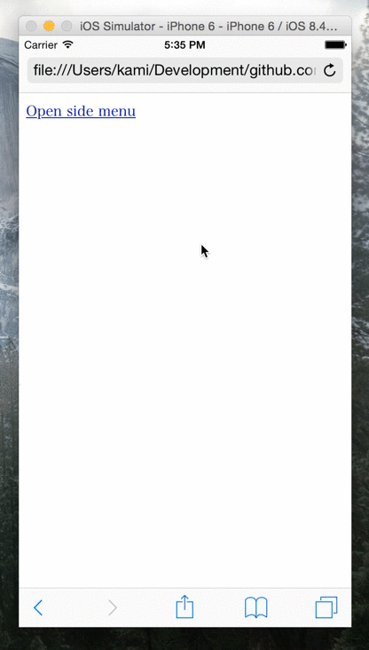

# jquery.sidemenu.js

jquery.sidemenu.js is the simplest side menu plugin (so-called on and off canvas menu).

## Download

- https://github.com/kami30k/jquery.sidemenu.js/archive/master.zip

## Demo



## Usage

Include `jquery.sidemenu.css`, [jQuery](https://jquery.com/) and `jquery.sidemenu.js`:

```html
<link rel="stylesheet" href="jquery.sidemenu.css">
<script src="jquery.js"></script>
<script src="jquery.sidemenu.js"></script>
```

Add `data-role="sidemenu"` to side menu container, and add `data-role="sidemenu-toggle"` to toggle.
And add `id` to container, then you can open menu by hash-tag link.

For example:

```html
<div id="sidemenu" data-role="sidemenu">
  <ul>
    <li><a href="#">Menu</a></li>
    <li><a href="#">Menu</a></li>
    <li><a href="#">Menu</a></li>
    <li class="divider"></li>
    <li><a href="#sidemenu" data-role="sidemenu-toggle">Close</a></li>
  </ul>
</div>

<a href="#sidemenu" data-role="sidemenu-toggle">Open side menu</a>
```

As you see, you can use `li.divider` to divide lists.

That's it.
In the case of basic usage, no JavaScript code is required.

## Customize

You can customize as follows:

```js
$.sidemenu({
  side: 'right', // Show side menu on right
  speed: 200     // Animation speed
});
```


## Methods

| Method | Description |
| --- | --- |
| $(selector).sidemenu(action) | Open or close side menu. Default action: `toggle`. |

## Contributing

1. Fork it ( https://github.com/kami30k/jquery.sidemenu.js/fork )
2. Create your feature branch (`git checkout -b my-new-feature`)
3. Commit your changes (`git commit -am 'Add some feature'`)
4. Push to the branch (`git push origin my-new-feature`)
5. Create a new Pull Request
